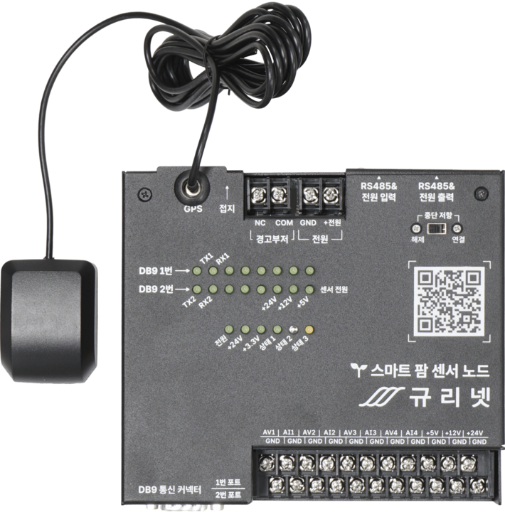

# SmartFarmST32

## Overview
**SmartFarm 프로젝트의 센서 노드 및 제어 노드에** 사용되는 **MCU Software 부분을** 다룹니다


## Block Diagram
```plantuml
skinparam linetype ortho
'skinparam nodesep 20

rectangle "통합 제어기" as controller #lightgreen {

}

rectangle "노드" as node #lightgray {
  rectangle "MCU 보드" as mcu_board #lightblue {
    rectangle "RJ45 1번 포트\n(RS485)" as rj45 {
      object "LED" as rj_led {
      - **GREEN (ACT) LED** 
        **꺼짐:** 노드가 선택되지 않음
        **켜짐:** 통합 제어기에 의해 **노드가 선택됨**\n
      - **YELLOW LED**
        **꺼짐:** MCU에 전원이 공급되지 않거나, Buzzer가 켜짐
        **켜짐:** MCU에 전원이 공급되어있으며, Buzzer가 꺼짐
      }
    }
    rectangle "RJ45 2번 포트\n(RS485)" as rj45_2 {

    }
    rectangle "Isolated RS485 Transceiver" as rs485 {

    }
    rectangle "STM32G0" as stm {

    }
    rj45 <--> rs485
    rj45 <-> rj45_2
    object "LED" as led {
      - **상태1 LED** 
        **깜빡임:** 통합 제어기로 부터 **명령 수신 가능 상태**\n
      - **상태2 LED**
        **꺼짐:** 노드가 선택되지 않음
        **켜짐:** 통합 제어기에 의해 **노드가 선택됨**\n
      - **상태3 LED**
        지정되지 않음\n
      - **제어 인터페이스 보드 장착시** DO1 ~ DO8 LED
        **꺼짐:** 출력이 비활성화 됨
        **켜침:** 출력이 활성화 되었으며, **300mA 이상의 부하가 감지됨**
        **깜빡임:** 출력이 활성화 되었으나, **부하가 감지되지 않음**
    }
    rectangle "GPS" as gps {

    }
    rectangle "3축 가속도 센서" as accel {

    }
    rectangle "인터페이스 커넥터" as connector {

    }
    stm <--u> rs485
    stm -r> led
    stm <-- gps
    stm <-- accel
    stm <--> connector
  }

  rectangle "둘 중 한가지를 연결" as select #lightblue {
    rectangle "센서 인터페이스 보드" as sensor_if {
      object "DB9 2CH" as db9 {
        - RS232
        - RS422
        - RS485
        - DDI (with 12V 전원 출력)
      }
      object "전원 출력" as power_output {
        - +5V
        - +12V
        - +24V
      }
      object "아날로그 입력" as analog_input {
        - 전압 (-10V ~ +10V)
        - 전류 (0 ~ 20mA)
      }
    }

    rectangle "제어 인터페이스 보드" as control_if {
      object "디지털 출력 8CH" as digital_output {
        - ON/OFF 제어
          (220VAC, 30VDC, 10A)
        - 소비 전류 측정
      }
      object "디지털 입력 8CH" as digital_input {
        - 가변 Threshold 지원
      }
      object "출력 수동 제어 스위치" as manual_switch {
        - 제품 전면에 위치
      }
      digital_input -[hidden] manual_switch
    }
  }
  connector <--> select
  sensor_if -[hidden] control_if
}
rj45 <-u> controller

rectangle "노드 ... N" as node2 #lightgray {
}
rj45_2 - node2

rectangle "제어 대상" as product {
  rectangle "센서" as sensor #lightgray {

  }
  sensor_if --> sensor

  rectangle "모터, etc..." as motor #lightgray {
  }
  control_if --l> motor
  motor -[hidden]- sensor
}
```

---
## 제품 이미지
### 센서 노드


---
### 제어 노드
